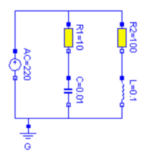
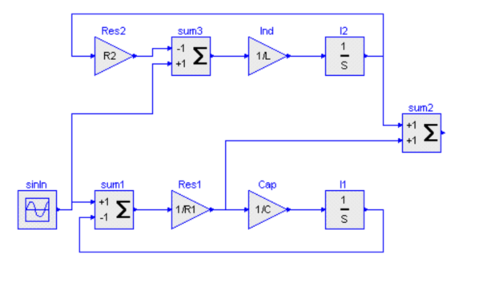

# Lecture 1: 初窥Modelica
作者：hyumo
课程地址: https://github.com/hyumo/ModelicaPrimer

---
## Modelica 是什么？
- 一种用于建立复杂物理模型的高级编程语言。

---
## Modelica 有什么特点？
- 面向对象 object-oriented
    - 模型复用
- 基于等式 equation-based，无因果关系 acausal
- 只负责建立模型，不负责求解。
    - 编译器
    - 求解器
---
## Modelica vs Simulink
 

---
## 为何使用 Modelica? 优势在哪？
- 相对于其他编程语言，它可更轻松且直观的描述系统的物理现象（acausal）。并通过连接组合进而构建大型、跨领域的复杂系统。
- 支持多种形式的模型构建
    - 连续模型
    - 离散模型
    - 混合模型
- 面向对象，高执行效率
- 开源的语言及标准模型库
    - Modelica Standard Library
---

## Modelica 实例及求解
- [洛伦兹系统 Lorenz system](https://en.wikipedia.org/wiki/Lorenz_system)