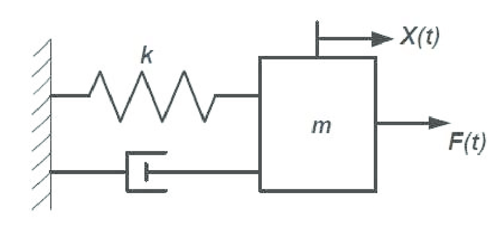

# Lecture 3: Modelica模型搭建流程
作者：hyumo
课程地址: https://github.com/hyumo/ModelicaPrimer

----
## 本课内容与意义
- 内容：介绍建模的前期准备以及模型构建流程。
- 意义：希望可以帮助大家对Modelica建模有一个全局认识。
----
## 建模准备流程
- 积累基本物理规律
  - 上课认真听讲，多读Paper，看视频教程。
- 确立模型用途
  - 影响搭建过程，工具选用及模型本身
- 分析并确定模型复杂度
  - 不要太高，也不要太低，满足要求最好。
----
## 一般Modelica模型的搭建流程（个人总结）
- 搭建first principle模型。
- 分析并设计模型结构，划分系统并确定系统间的连接关系。
- 将系统不断地再划分子系统，直至系统差不多可以只用基本物理规律表达。
- 将子系统进行类化。
- 继承该类，并进行实例化（填充物理）。
----
## 质量弹簧阻尼系统演示

